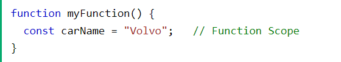

# JavaScript Scope

### Scope determines the accessibility (visibility) of variables.
### JavaScript variables have 3 types of scope:

* Block scope
* Function scope
* Global scope
---
# Block Scope
### Before ES6 (2015), JavaScript variables had only Global Scope and Function Scope.
### ES6 introduced two important new JavaScript keywords: let and const.
### ES6 introduced two important new JavaScript keywords: let and const.
### Variables declared inside a { } block cannot be accessed from outside the block:

### Variables declared with the var keyword can NOT have block scope.
### Variables declared inside a { } block can be accessed from outside the block.
 
--- 
# Local Scope
### Variables declared within a JavaScript function, are LOCAL to the function:
 
 ### Local variables have Function Scope:
 ### They can only be accessed from within the function.
 ### Since local variables are only recognized inside their functions, variables with the same name can be used in different functions.
 ### Local variables are created when a function starts, and deleted when the function is completed.
 ---
  # Function Scope
  1.   JavaScript has function scope: Each function creates a new scope
  2. Variables defined inside a function are not accessible (visible) from outside the function.
  3. Variables declared with var, let and const are quite similar when declared inside a function.
  4. They all have Function Scope:
  
  ---
  # Global JavaScript Variables
  ### A variable declared outside a function, becomes GLOBAL.
  
  ### A global variable has Global Scope:
  ### All scripts and functions on a web page can access it. 
  ---
  # Global Scope
  ### Variables declared Globally (outside any function) have Global Scope.
  ### Global variables can be accessed from anywhere in a JavaScript program.
  ### Variables declared with var, let and const are quite similar when declared outside a block. 
  ### They all have Global Scope:
  ---
  1. var x = 2;       // Global scope
  2. let x = 2;       // Global scope
  3. const x = 2;     // Global scope
  ---
  # Strict Mode 
  ### All modern browsers support running JavaScript in "Strict Mode".
  ### You will learn more about how to use strict mode in a later chapter of this tutorial.
  ###   In "Strict Mode", undeclared variables are not automatically global.
  ---
  # Global Variables in HTML
  ### With JavaScript, the global scope is the JavaScript environment.
  ### In HTML, the global scope is the window object.
  ### Global variables defined with the var keyword belong to the window object:
  
  ### Global variables defined with the let keyword do not belong to the window object:
  
  ---
  # Warning
  ### Do NOT create global variables unless you intend to.
  ### Your global variables (or functions) can overwrite window variables (or functions).
  ### Any function, including the window object, can overwrite your global variables and functions.
  ---
  # The Lifetime of JavaScript Variables
  1. The lifetime of a JavaScript variable starts when it is declared.
  2. Function (local) variables are deleted when the function is completed.
  3. In a web browser, global variables are deleted when you close the browser window (or tab).
  ---
  # Function Arguments
  ### Function arguments (parameters) work as local variables inside functions.
  --- 
  # JavaScript Hoisting
  #### Hoisting is JavaScript's default behavior of moving declarations to the top.
  ---
  ## JavaScript Declarations are Hoisted
  ### In JavaScript, a variable can be declared after it has been used.
  ### In other words; a variable can be used before it has been declared.
  ### Example 1 gives the same result as Example 2:
  
  ### To understand this, you have to understand the term "hoisting".
  ### Hoisting is JavaScript's default behavior of moving all declarations to the top of the current scope (to the top of the current script or the current function).
  ---
  # The let and const Keywords
  ### Variables defined with let and const are hoisted to the top of the block, but not initialized.
  ### Meaning: The block of code is aware of the variable, but it cannot be used until it has been declared.
  ### Using a let variable before it is declared will result in a ReferenceError.
  ### The variable is in a "temporal dead zone" from the start of the block until it is declared:
  ---
  # JavaScript Initializations are Not Hoisted
  ### JavaScript only hoists declarations, not initializations.
  ### Example 1 does not give the same result as Example 2:
  
  ### Does it make sense that y is undefined in the last example?
  ### This is because only the declaration (var y), not the initialization (=7) is hoisted to the top.
  ### Because of hoisting, y has been declared before it is used, but because initializations are not hoisted, the value of y is undefined.
  ### Example 2 is the same as writing:
  
  ---
  # Declare Your Variables At the Top !
  1. Hoisting is (to many developers) an unknown or overlooked behavior of JavaScript.
  2. If a developer doesn't understand hoisting, programs may contain bugs (errors).
  3. To avoid bugs, always declare all variables at the beginning of every scope.
  4. Since this is how JavaScript interprets the code, it is always a good rule.
  ### JavaScript in strict mode does not allow variables to be used if they are not declared.
  ### Study "use strict" in the next chapter.  
  ---
  # TDZ 

---
## Инициализация и объявление переменной
### Когда в JavaScript создаётся переменная, она инициализируется со значением undefined. Если мы сейчас попытаемся логировать переменную declaration, то нам вернётся undefined.
### Инициализация — это присваивание значения переменной.
1. Declaration -> 2. Initialization
# var , let , const
### В JavaScript есть два ограничения, касающиеся имён переменных:
1. Имя переменной должно содержать только буквы, цифры или символы $ и _.
2. Первый символ не должен быть цифрой.
---
# Scoping rules
### В JavaScript есть два типа области видимости — глобальная и локальная (global scope и function scope).
### var имеет функциональную область, а let и const — блочную.
---
# Loops with closures
### Если вы используете letвместо этого varв цикле, с каждой итерацией
### вы получаете новую переменную. Это означает, что вы можете
### безопасно использовать замыкание внутри цикла.

# Temporal Dead Zone
### Из-за временной мертвой зоны переменные, объявленные с помощью, let , const не могут быть доступны до их объявления. Попытка сделать это выдает ошибку.

# const
### constочень похож на let— он блочный и имеет TDZ. Однако есть две вещи, которые отличаются друг от друга.
## Нет повторного назначения
### Переменная, объявленная с помощью, constне может быть переназначена.
1. const a = 42;
2. a = 43; // TypeError: Assignment to constant variable.
### Обратите внимание, что это не означает, что значение неизменно. Его свойства по-прежнему можно изменить.
---
# Temporal dead zone let and const
### TDZ : Is the term to describe the state
### where variables are un-reachable. They are
### in scope, but they aren't declared.
### The let and const variables exist in the TDZ
### from the start of their enclosing scope
### until they are declared.
---

---
# How to avoid TDZ ?
### Relatively simply, always make sure you
### define your lets and consts at the top of
### your scope.

